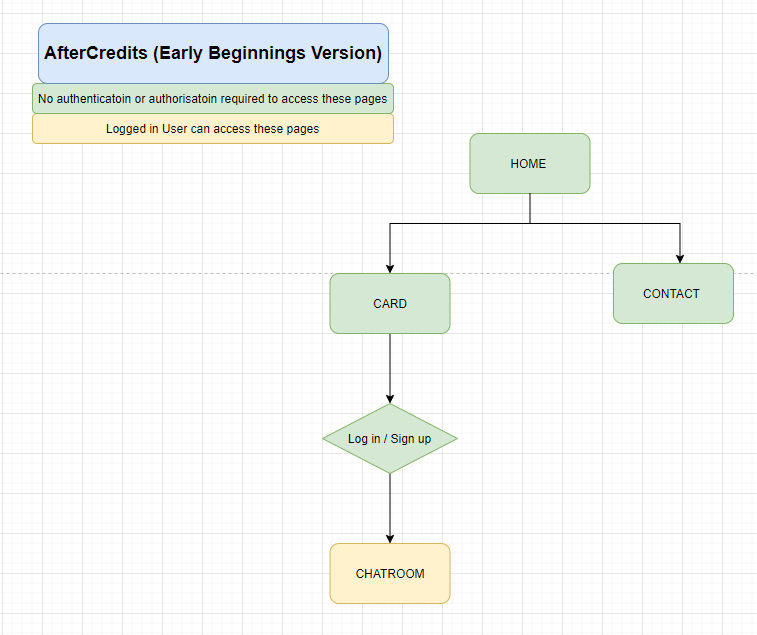

# T3A2-A - Full Stack App 
## Part A
## AfterCredits
#### By: Chris Gibs & Gizelle van Zyl
___

### R1: DESCRIPTION OF WEBSITE

#### PURPOSE 
AfterCredits is a movie chat app. There are two proposed versions of the app:

**A. Early Beginnings version:** The initial core app version is designed to build user community. There will be one movie or series for the month, similar to a book club. Community users can see what the select movie/series is so that they can have a chance to watch it if they haven't seen it yet. When they are ready, they can join the chatroom to discuss the movie/series with other users.

**B. Expansion version:** The expanded app will have multiple movies/series, each with their own chatroom. Users can join a chatroom to discuss any movie or series of their liking whenever they wish, rather than waiting for a single monthly selection. 

The development plan is to build the Early Beginnings version first and to then commence incorporating as many features as possible whilst working towards building the total Expansion version. It is fairly unlikely that the entire Expansion version will be completed within the relevant development timeframe. It is anticipated that the final product will be an Early Beginnings version incorporating some additional features that have been proposed for the Expansion version. 

From a real life marketing perspective, the plan would be to achieve continued member and participation growth by commencing with a small and intimate community and gradually expanding the collection of movie/series chatrooms as the community grows (and becomes, perhaps, less intimate due to the increased number of users), thereby allowing for the users to be spread out across multiple chatrooms. 

---
#### FUNCTIONALITY/ FEATURES

**A. Early Beginnings version:**

###### Sitemap: Early Beginnings version

###### Log in/Sign up: Early Beginnings version
Users can sign up and then log in to access the chatroom to discuss the movie/series of the month. They will need the following to sign up:
- username
- email
- password

###### Authentication and Authorisation: Early Beginnings version
Authentication and Authorisation can be handled using the following gems:
- Devise 
- Rolify

###### Forms
- Netlify forms
- Consider using Simple Form and Bootstrap

###### Movie/Series Cards: Early Beginnings version
The home page includes one movie/series card for the month. 
Each movie/series card will contain the:
- title
- image 

The initial title and image can be saved in the source code as a placeholder. Thereafter, the movie data can be accessed from an API such as the Movie Database (IMDB Alternative). The RAPID API version currently has a basic price plan of $0.00 per month that inludes 1,000 requests per day and is available at: https://rapidapi.com/rapidapi/api/movie-database-imdb-alternative/

###### Chatroom, CRUD & Authorisation: Early Beginnings version
Users can post, edit and delete their own messages.
Admin role users can additionally delete anyone's message.

Each message will include:
- username
- message
- posting time and date

###### Contact & Attribution: Early Beginnings version
All website visitors can access the contact and attribution page.

The AftreCredits head office address will be accompanied by a location map.  The interactive map of the business address will have a marker showing the location. Users can interact with the map.
The map data can be provided by an API such as Bing Maps API, available at https://www.bingmapsportal.com/ 
Alternatively, consider using Google Maps API.

This page will also include links to the creators github accounts. An admin email address will be included ot allow users to contact an admin directly.

###### Styling, design and aesthetics: Early Beginnings version
Styling will include the following:
1.	Icons: https://fontawesome.com
2.	Google fonts: https://fonts.google.com/
3.  Background image/s from unsplash: https://unsplash.com/

###### Database 

---

#### FUNCTIONALITY/ FEATURES

**B. Expansion version:**

###### Sitemap: Expansion version

###### Log in/Sign up: Expansion version
As above. An expansion feature could enable users to select an avatar image or upload their own image.

###### Authentication and Authorisation: Expansion version
As above.

###### Movie/Series Cards: Expansion version
The home page includes multiple movie/series cards.
Each home page movie/series card will contain the:
- title
- image 

Users may click on a card to view additional movie information, which may include any of the following: Year, Metascore Rating, IMDB rating, Release date, Runtime, Genre, Directors, Writers, Actors, Plot, Awards etc.

###### Chatroom, CRUD & Authorisation: Expansion version
As above. 

Additionally user messages can display with the user chosen avatar or images. Users can click on a username to see all of their messages in a chatroom.*** for each chatroom or total?
Users can view all of their own messages. *** for each chatroom or total?

Each movie/series can have two chatrooms:
- with spoilers
- without spoilers

Chatrooms can contain many messages. There should be a scroll bar or a hide/show more button so that only the most recent messages are visible but that the user may still look at older messages should they choose to do so.

###### Contact & Attribution: Expansion version
As above but instead of including an admin email address, users can submit a contact form. 
- The contact form will be handled by Netlify forms.

###### Styling, design and aesthetics: Expansion version
Styling will include the following:
1.	Icons: https://fontawesome.com
2.	Google fonts: https://fonts.google.com/
3. Background image/s from unsplash: https://unsplash.com/
4.  Animated background: https://greensock.com/

###### Additional features for future development (the nice-to-have-but-not-included list)
- A search feature so that users can search for a movie or series by genre, actor, rating etc. This feature will not be pursued in the current project. It would require database design changes and features that are beyond the scope of the current project.
- Admin role users or all users can add their own movie/series cards.

###### ******* We should discuss if or how to handle inappropriate content (beyond admin can delete). Perhaps the sign in should include line stating all users are over the age of 18 when signing up.

---

#### TARGET AUDIENCE

**A. Early Beginnings version:**
The target audience includes users who:
- want to join a monthly movie/series club
- to discuss or read comments about a movie/series 

**B. Expansion version:**
The target audience includes users who:
- want to discuss or read comments about movies/series 
- get more information about movies/series

#### TECH STACK 

- **HTML**: HyperText Markup Language is the standard markup language for documents to display in web browsers. 
- **CSS**: Cascading Style Sheets describe the presentation and styling of markup language documents.

##### Front-end/client side
- **React.js**: [React](https://reactjs.org/) is a front-end (client side) **JavaScript** library used to build user interfaces and components.
- **Yarn**: [Yarn](https://yarnpkg.com/) is a [package manager](https://engineering.fb.com/2016/10/11/web/yarn-a-new-package-manager-for-javascript/) for JavaScript (client side) that will be used for this project.
- **Jest**: [Jest](https://jestjs.io/) is a testing framework that works with React projects (testing front-end).
- **Netlify**: [Netlify](https://www.netlify.com/) will be used to deploy the front-end React repository. The service used for this project is free of charge.

##### Back-end/client side
- **Ruby on Rails**: [Ruby on Rails](https://rubyonrails.org/) is a back-end/ server side application framework written in Ruby. It has a model-view-controller framework.
- **RubyGems**: [Ruby Gems](https://rubygems.org/) is a package management framework for Ruby and is used to distribute Ruby programs and libraries. RubyGems is a tool used to install gems.
- **Rspec**: [Rspec](https://rspec.info/) is a meta-gem used for testing in Ruby on Rails.
- **Heroku**: [Heroku](https://www.heroku.com/) is a cloud platform that supports Ruby on Rails. It will be used to deploy the Ruby on Rails repository (back-end/ server-side). The service used for this project is free of charge.

##### Database
- **PostgreSQL**: [PostgreSQL](https://www.postgresql.org/) is a free relational database management system.

##### Repositories
- **Github**: [Github](https://github.com/) is a development platform and service hosting Git version control. The service used for this project is free of charge.

##### Source Control 
- **Git**: [Git](https://git-scm.com/) is a version control system for tracking changes across a set of files and to coordinate work between programmers working collaboratively on developing source code.

Proposed version control:[^1] 
1.    Create app in central repository on Github
2.    Clone to local
3.    Developers checkout their own branch   `$git checkout -b Developername`
4.    Commit changes on local
5.    (a) When the central repository has changed, developers need to merge their local with the central repository by pulling the changes from the main branch and merging ` $git merge master `
6.    Resolve conflicts locally.
7.    Push changes to the central repository ` $ git push origin Developername`. Then merge the developer's branch into the central repository master branch (you can also do this by following the prompts in github)

Or instead of 5(a), the developer may merge their branch on github (without updating their main branch) by pushing their branch to github, making a pull request on github (from the main branch to their branch) and if there are no conflicts, merge. Then update local main from github main by making a pull request.
[^1]: This source control flow was used by Team Hack Overflow, with special credit to Roba Elshazly.

### R2: DATAFLOW DIAGRAM

Provides dataflow diagram(s) that strictly follow the standard convensions to clearly identify the processes within your application. Clearly depicts where data is coming from, where it is going and how it is being stored. 
https://edstem.org/courses/4966/lessons/12821/slides/91792 

### R3: APPLICATION ARCHITECTURE DIAGRAM
Shows almost flawless understanding of the high level structure of the app
https://edstem.org/courses/4966/lessons/12821/slides/91793 

### R4: USER STORIES
Provides multiple user stories that use ‘persona, what and why’ that outline meaningful features of project. Shows evidence of user story revision and refinement. 

### R5: WIREFRAMES
Wireframes were prepared using Balsamiq Wireframes.

**A. Early Beginnings version**

### R6: TRELLO
https://trello.com/b/VLtFLtdT/full-stack-app
Simple and clear standards for planning methodology chosen and adhered to.