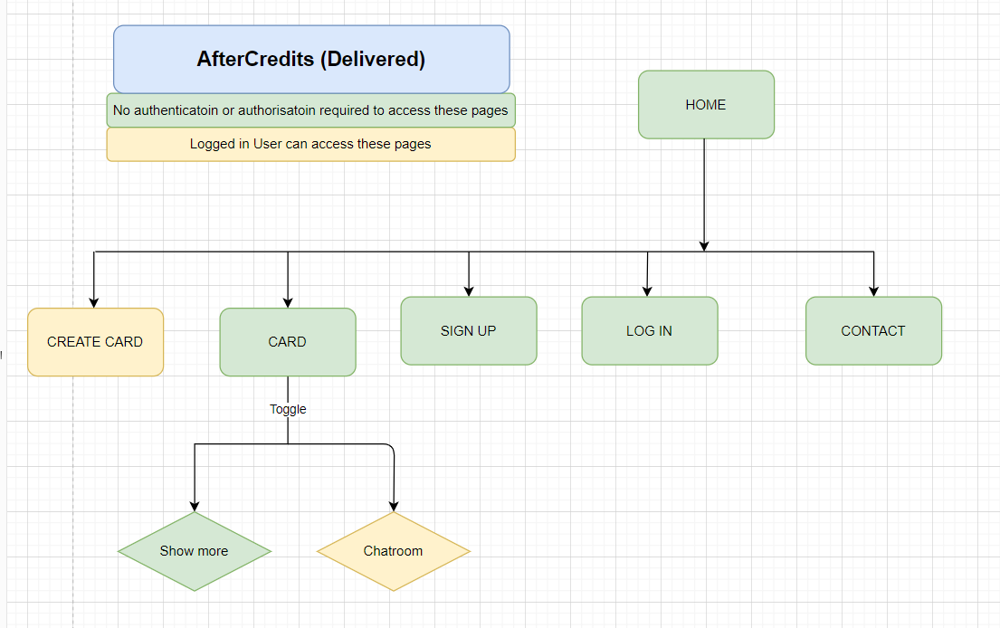
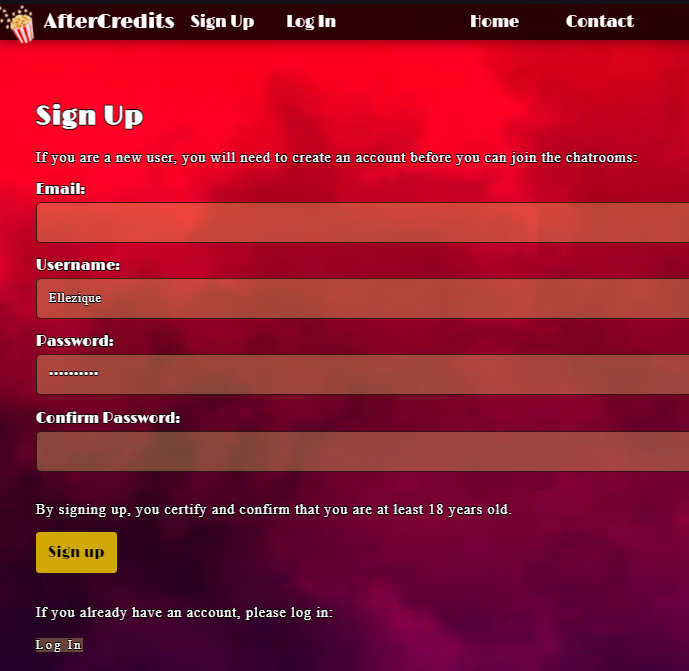
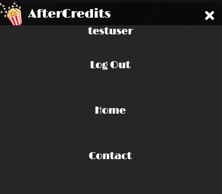
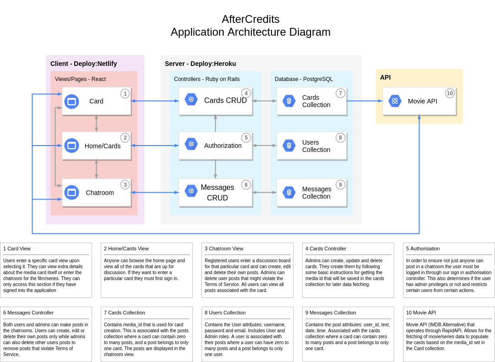

# T3A2-A  Full Stack App (PART A)
## AfterCredits
#### By: Chris Gibson & Gizelle van Zyl
GitHub repository: https://github.com/Ellezique/Full-Stack-App-PART-A

-----------------------------------------------------------
#### GitHub repositories:
- Front end: https://github.com/Ellezique/aftercredits-client
- Back end: https://github.com/Ellezique/aftercredits-server
- This Readme: https://github.com/Ellezique/Full-Stack-App-PART-A  

#### Deployed Sites:
- Netlify front end deployment: https://aftercredits.netlify.app
- Heroku back end deployment: https://aftercredits-api.herokuapp.com/

Heroku and Netlify are connected to their respective Github repositories and are set up for automatic deployment from the master branch.

----------------------------------------------------------------

### R1: DESCRIPTION OF WEBSITE

#### PURPOSE 
AfterCredits is a movie discussion app (ideally for people aged 18 and older). There are two proposed versions of the app:

**A. Early Beginnings version:** The initial core app version is designed to build user community. There will be one movie or series for the month, similar to a book club. Community users can see what the selected movie/series is so that they can have a chance to watch it if they haven't seen it yet. When they are ready, they can join the chatroom to discuss the movie/series with other users.

**B. Expansion version:** The expanded app will have multiple movies/series, each with their own chatroom. Users can join a chatroom to discuss any listed movie or series of their liking whenever they wish, rather than waiting for a single monthly selection. 

From a real life marketing perspective, the plan would be to achieve continued member and participation growth by commencing with a small and intimate community and gradually expanding the collection of movie/series chatrooms as the community grows (and becomes, perhaps, less intimate due to the increased number of users), thereby allowing for the users to be spread out across multiple chatrooms. 

**C. Delivered Application:** 

The delivered application has built in functionality to create additional cards and can accommodate both the core and expansion purposes. 

Users can see the listed movie/series cards with the film title and poster. A user can select a card and then see more information about the movie/series (release date, genre, cast and description) or enter the chatroom to see what other users have posted and join the discussion by posting their own comments.

AfterCredits is a site for users to get information about listed movies/series and join a chatroom discussion.

DISCLAIMER:
The app was planned with an early beginnings version (with basic features) and an expansion version with numerous features (to strive towards but unlikely to fully implement by the deadline). The delivered application, as anticipated, includes numerous features from the expansion version but does not implement all features from the expansion version.
Details of the planned early beginnings and expansion apps are included along with details of the delivered application.

---
#### PLANNING FUNCTIONALITY/ FEATURES

**A. Early Beginnings version:**
(see below for the functionality/featuers and screenshots in the delivered app)

###### Log in/Sign up: Early Beginnings version
Users can sign up and then log in to access the chatroom to discuss the movie/series of the month. They will need the following to sign up:
- username
- email
- password

###### Authentication and Authorisation: Early Beginnings version
Authentication and Authorisation will be handled using:
- Knock
- JWT

There will be two user roles: 
- Admin
- User

###### Movie/Series Cards: Early Beginnings version
The home page includes one movie/series card for the month. 
The movie/series card will contain the:
- title
- poster (image) 

The initial title and image can be saved in the source code as a placeholder. Thereafter, the movie data can be accessed from an API such as the Movie Database (IMDB Alternative). The RAPID API version currently has a basic price plan of $0.00 per month that inludes 1,000 requests per day and is available at: https://rapidapi.com/rapidapi/api/movie-database-imdb-alternative/
Once the API is implemented, the imdb_id can be stored in the database when the card is created. That imdb_id can then be used to fetch the title and poster(an image url) from the API. 

A "Show more" button can then toggle additional data from the API e.g. a movie or series description.

###### Chatroom
Each movie/series card contains its own chatroom relevant to that movie/series.

Messages will have full CRUD functionality. Users can post, edit and delete their own messages. Admin role users can additionally delete anyone's message to ensure a means for removing inappropriate content.  

Each message will include:
- username
- message
- posting time and date

###### Contact Page: Early Beginnings version
All website visitors can access the contact page.

An Admin email address will be included to allow users to contact an admin directly.

The AfterCredits head office address will be listed and accompanied by a static location map. 

###### Styling, design and aesthetics: Early Beginnings version
Styling will include the following:
1.	Icons: https://fontawesome.com
2.	Google fonts: https://fonts.google.com/
3.  Background image/s from unsplash: https://unsplash.com/

Each JavaScript component will have its own css stylesheet e.g. Navbar.js and Navbar.css

---

#### PLANNING FUNCTIONALITY/ FEATURES
(see below for the functionality/featuers and screenshots in the delivered app)

**B. Expansion version:**

###### Log in/Sign up: Expansion version
As above. An expansion feature could enable users to select an avatar image (a limited number of images posing no storage issues) or upload their own image (requiring a storage solution such as Cloudinary).

###### Authentication and Authorisation: Expansion version
As above.

###### Movie/Series Cards: Expansion version
The Cards feature should have full CRUD functionality so that an Admin user can change the monthly movie/series card and add additional cards as the site grows towards the Expansion version. 

The home page includes multiple movie/series cards.
Each home page movie/series card will contain the:
- title
- image 

Users may click on a card to view additional movie information, which may include any of the following: Year, Metascore Rating, IMDB rating, Release date, Runtime, Genre, Directors, Writers, Actors, Plot, Awards etc.

###### Chatroom: Expansion version
As above. 

Additionally user messages can display with the user's chosen avatar or image. Users can click on a username to see all of their messages.

Each movie/series can have two chatrooms:
- with spoilers
- without spoilers
A spoilers boolean could be added to the Cards table to distinguish spoiler and no-spoiler messages. An additional button will be needed to allow users to select whether they want to view the spoiler or no-spoiler chatroom.

Chatrooms can contain many messages. There could be a scroll bar or a hide/show more button so that only the most recent messages are visible but that the user may still look at older messages should they choose to do so.

###### Contact: Expansion version
As above but instead of including an admin email address, users can submit a contact form. 
- The contact form could be handled using Netlify forms.

The interactive map of the business address will have a marker showing the location. Users can interact with the map.
The map data can be provided by an API such as Bing Maps API, available at https://www.bingmapsportal.com/ or alternatively, the Google Maps API.

This page will also include links to the developers' GitHub accounts.

###### Styling, design and aesthetics: Expansion version
Styling could include the following:
1.	Icons: https://fontawesome.com
2.	Google fonts: https://fonts.google.com/
3.  Background image/s from unsplash: https://unsplash.com/
4.  Animated background: https://greensock.com/

###### Additional features for future development (the nice-to-have-but-not-included list)
- A search feature so that users can search for a particular movie or series by genre, actor, rating etc. This feature will not be pursued in the current project. It would require database design changes and features that are beyond the scope of the current project.
- Thorough solutions to moderating and handling user input and dealing with inappropriate content.

#### DELIVERED FUNCTIONALITY/ FEATURES
**C. Delivered Application:** 

###### Sitemap: Early Beginnings version

###### Database 

The backend Rails API app handles the users, messages and cards. The data is stored in a postgreSQL database.

###### Log in/Sign up: Delivered
Users can sign up if they do not have an account. The log in page has a link to the sign up page and vice versa. 

If users have previously created an account, they can log in.

###### Authentication and Authorisation: Delivered

Authentication and Authorisation is handled using:
- Knock
- JWT

There are two user roles:
- Admin
- User

The rails api application has default users and details created in the seeds file.

###### Movie/Series Cards: Delivered
The home page includes multiple movie/series cards and more can be added using only the relevant imdb id. All other details are then called from Movie Database (IMDB Alternative) hosted on Rapid API. The postgreSQL database only stores the imdb_id thereby eliminating any copyright concerns that could arise from copying data from IMDB.

A user can select the movie/series card that interests them:

A "Show more" button toggles additional movie data. A "Chatroom" button toggles the chatroom. Both can be open at the same time.

###### Chatroom: Delivered
Each movie/series card has its own chatroom. The chatroom shows all messages for that card. When there a lot of messages, users will have a scroll bar to use should they wish to scroll down to old messages. Logged in users can post messages.

An option button reveals edit and delete buttons. Individual messages can be edited or deleted. A pop up warns users before deleting a message.

This is a fullstack application using React app on the front end and a Rails API app in the backend. The backend Rails API handles messages, users and cards and data is stored in a postgreSQL database. 

At the time of deadline, the AfterCredits app calls all messages from the server before processing them on the frontend. Future improvements to the app should handle this in the backend. 

###### Contact Page: Delivered

Users can contact administrators by completing the contact form. The contact form and submissions are handled by Netlify. Submissions have been tested and receipt confirmed.

Users can see the fake business address on a bing map. The map is interactive with zoom in and out buttons. There is also a locate me button, an arrow that shows or hides "Australia QLD Brisbane Brisbane City" and the option to view the map in road, aerial or bird's eye view and the option to toggle labels on or off. The bottom corner of the map has the scale. If the user hovers over the pushpin, the info box will open (which can be closed by clickin on the close circle in the top right of the infobox or by moving the mouse away).

The contact page also contains credits. The project is built by Gizelle and Chris and their GitHub profile links open in new tabs when clicked. Free use of the background videos is permitted with credit, and accordingly, hyperlinks are included for the sources. 

###### NavBar: Delivered

The Navigation bar has links for log in, sign up, home and contact. When a user is logged in, the navbar shows their username and the option to log out (instead of log in/sign up).

The navigation bar is responsive and has a drop down menu. The navbar is slightly transparent. The links light up red on hover. The AfterCredits text lights up on hover.

Styling, design and aesthetics:
- The navbar icons are from fontawesome: https://fontawesome.com
- Google fonts were used to add to the limelight "hollywood" theme: https://fonts.google.com/
- Background videos are free to use and credited on the contact page. The videos are stored in cloudinary.
- Hover effects are used on buttons, links and cards.

###### Page Not Found: Delivered
There is a special page for error 404 with a link to the home page (to improve user experience).

-------

#### TARGET AUDIENCE

Broadly, the target audience inludes anyone that enjoys watching movies/series and would like to read other users' comments and engage in discussions about movies/series. The app is a community for watchers, bingers, enthusiasts, the curious and critics alike.

**A. Early Beginnings version:**
The target audience includes users who:
- want to join a monthly movie/series club
- want to discuss or read comments about a movie/series
- are, ideally, at least 18 years old (movies and series have classifications and age restrictions which vary between jurisdictions, therefore it is preferable that users are at least 18 years old when entering chatrooms).

**B. Expansion version:**
The target audience includes users who:
- want to discuss or read comments about a number of different listed movies/series 
- get more information about listed movies/series

**C. Delivered Application:** 
As above. The onus is on users themselves to certify and confirm that they are at least 18 years old when signing up. 

#### TECH STACK, third party APIs and Packages 

- **HTML**: HyperText Markup Language is the standard markup language for documents to display in web browsers. 
- **CSS**: Cascading Style Sheets describe the presentation and styling of markup language documents. There are numerous style sheets for general style, components and pages. Not all pages and componenets required their own stylesheets.

##### Front-end/client side
- **React.js**: [React](https://reactjs.org/) is a front-end (client side) **JavaScript** library used to build user interfaces and components.
- **Yarn**: [Yarn](https://yarnpkg.com/) is a [package manager](https://engineering.fb.com/2016/10/11/web/yarn-a-new-package-manager-for-javascript/) for JavaScript (client side) that will be used for this project. It is prefereable to use yarn with React apps. The most stable version currently is 1.22.5, which will be used for this project. To add and remove packages, `yarn add [package]` and `yarn remove [package]`. Install all project dependencies using `yarn install`. Dependencies can be upgraded to the current stable versions by running `yarn upgrade`. All dependencies and configuration for the React side of AfterCredits will be specified in the package.json file.
- **Jest**: [Jest](https://jestjs.io/) is a testing framework that works with React projects (testing front-end). It was used for testing along with the testing-library.
- **Packages**
- [Bing Maps-React](https://www.npmjs.com/package/bingmaps-react) is a package that makes it relatively simple to use the Bing Maps API, and accordingly requires a Bing Maps API key. Unfortunately, this package throws an error when testing with Jest. This error remains an open issue that has been previously reported and followed up on by one of the developers in this app: https://github.com/milespratt/bingmaps-react/issues/32

- [Font Awesome](https://fontawesome.com) provides vector icons and logos. The initial logo was a vector icon, which was later replaced by a popcord png image. Fontawesome vector icons were used for the navbar burger menu icons.
- [Axios](https://www.npmjs.com/package/axios) is a promise based HTTP client for the browser. It was especially useful on the front end application for API calls (request and response).
- As this is a React application, dependencies include testing-library for react and jest as well as react-dom and react-router-dom.
- **Netlify**: [Netlify](https://www.netlify.com/) is used to deploy the front-end React repository. The service used for this project is free of charge. Netlify forms was used for the contact form on the contact page and Netlify receives and stores the contact information submitted (and also includes a helpful spam filter).

##### Back-end/client side
The back end application is a Rails API for messages, users and movie/series cards.
- **Ruby on Rails**: [Ruby on Rails](https://rubyonrails.org/) is a back-end/ server side application framework written in Ruby. It has a model-view-controller framework.
- **Rspec**: [Rspec](https://rspec.info/) is a meta-gem used for testing in Ruby on Rails. Tests have been prepared for models and requests.
- **RubyGems**: [Ruby Gems](https://rubygems.org/) is a package management framework for Ruby and is used to distribute Ruby programs and libraries. RubyGems is a tool used to install gems.
The following additional gems were used to assist with testing the rails api:
- [Factory Bot](https://github.com/thoughtbot/factory_bot_rails) contains methods to dynamically create fake seed data for the testing environment. A factories folder contains files for card, message and user. 
- [Database Cleaner](https://rubygems.org/gems/database_cleaner/versions/1.5.3) is a gem that was used for cleaning databases in the testing environment. This gem was needed to get rid of the factory bot data.
- [Shoulda Matchers](https://github.com/thoughtbot/shoulda-matchers) provides RSpec-compatible one-liners to test common Rails functionality that, if written by hand, would be much longer, more complex, and error-prone. Shoulda Matchers was used to test some model associations and validations.
- [Knock](https://rubygems.org/gems/knock) is a gem that provides for JWT authentication for the Rails API app.

- **Heroku**: [Heroku](https://www.heroku.com/) is a cloud platform that supports Ruby on Rails. It will be used to deploy the Ruby on Rails repository (back-end/ server-side). The service used for this project is free of charge.

**The third party API's used are**:
- [Bing Maps](https://www.bingmapsportal.com) for the interactive map on the contact page.
- [Movie Database IMDB Alternative](https://rapidapi.com/rapidapi/api/movie-database-imdb-alternative/) to retrieve movie/series data using only the imdb id.

##### User Testing (Development and Production)
Manual testing was recorded in video format and uploaded to Youtube. The manual video tests include tests for development and production testing. They can be accessed at the following channel: https://www.youtube.com/channel/UClVdwtuINqN1dOWUrmhG8rA

- In future, Cypress could be considered as an alternative for user testing.

##### Database
- **PostgreSQL**: [PostgreSQL](https://www.postgresql.org/) is a free relational database management system. It stores the data for users, messages and move/series cards.

##### Repositories
- **Github**: [Github](https://github.com/) is a development platform and service hosting Git version control. The service used for this project is free of charge.

##### Source Control 
- **Git**: [Git](https://git-scm.com/) is a version control system for tracking changes across a set of files and to coordinate work between programmers working collaboratively on developing source code.

###### PROPOSED BASIC SHARED REPOSITORY WORKFLOW

A. SETUP

1.    **Create app in central repository on GitHub.** Both developers will have access to push and pull- Developers must do all their work on a different branch to master and must not commit to the master branch directly.

2.    **Each developer clones the main GitHub repository to their local.** Developers are working in VS Code.

3.    In local, developers create and checkout their own branch:  `$git checkout -b Developername`. 

B. DEVELOPMENT

4. Developers should do all their work on their own branch and not commit to the central repositry (GitHub) master branch directly. Developers should work only on their `Developername` branch. `$ git branch` to see what branch you are on. If you are not on your branch `$ git checkout Developername`

5.  **Code in your Developername branch** and then stage changes in local `$ git add .` and commit changes with `$ git commit -m "meaningful commit description"`.

6. The developer can incorporate changes from the GitHub repo into the branch that they are on by making sure they are on their `Developername` banch and then:  `$ git merge master`. They can pull using `$ git pull origin master `. **Resolve conflicts locally in VS Code** before pushing to GitHub.

7. Developers can **push their changes to GitHub** from their developer branch `$ git push origin Developername`. Developers can then follow the prompts in the GitHub repository "Pull requests tab" to merge their Developername branch with the Github master branch (green buttons) and delete their branch after it has been merged with the Github central master branch (purple button).   

### R2: DATAFLOW DIAGRAM

### R3: APPLICATION ARCHITECTURE DIAGRAM

### R4: USER STORIES

### PERSONAS
|         | Who are they? | What is their main goal? | What is their main barrier to achieving this goal? |
|---------|---------------|--------------------------|----------------------------------------------------|
| Binge Watcher | A person that uses streaming services such as netflix to binge watch shows and movies | To discuss in real time what is happening in their favourite shows while they are watching them | Finding a chat application that supports live message updates without having to refresh the page/app |

|         | Who are they? | What is their main goal? | What is their main barrier to achieving this goal? |
|---------|---------------|--------------------------|----------------------------------------------------|
| Movie Enthusiast | A person that regularly goes to the cinema to watch the latest movies | To find a place where others that share their interest can gather to discuss the latest movies | Finding a website that facilitates discussion around this mutual interest |

|         | Who are they? | What is their main goal? | What is their main barrier to achieving this goal? |
|---------|---------------|--------------------------|----------------------------------------------------|
| AfterCredits Administrator | Users with admin privileges on the AfterCredits web app | General admin duties around card creation and chatroom monitoring | The functionality present in the app and the authentication mechanism present to limit who can access that functionality |

### STORIES
As a Binge Watcher of TV shows and movies, I want to feel like the discussion I have in the chatroom is happening in real time so we can react/discuss things that are happening as it unfolds.

As a Binge Watcher, I want to be able to use the site on my phone and for it to be a smooth experience so I can stay in the conversation while I am on the move.

As a Binge Watcher, I dont want other users to be able to change my posts, so I know what I post is safeguarded and is my own content.

As a Binge Watcher, I want to be able to contact an Admin so that I can send them feedback about the site or to inform them about issues I have with either the site or other users.

As a Movie Enthusiast, I want to go into chatrooms based around my favourite films/shows with others, so I can share my opinions and gain insight from our discussions.

As a Movie Enthusiast, I want to be able to view the initial content of the site without registering so I can see what it is all about before I go through a potentially annoying and lengthy process of creating an account and giving away my personal details.

As a Movie Enthusiast, I want my posts to be there when I return to the chatroom so I can continue the conversation later.

As a AfterCredits Administrator, I want to have the ability to remove certain user messages from the chatroom if they are deemed to break the terms of service for the web app, so I can ensure the chatroom stays civil even during heated discussions.

As a AfterCredits Administrator, I want to be able to manage movie/series cards for Users to view and interact with, so I can enable users to have their conversations on that particular movie/series.

As a AfterCredits Administrator, I want to be able to join the conversation alongside other users, so I can share my views on my favourite hobby with them.

### R5: WIREFRAMES
Wireframes were prepared using Balsamiq Wireframes. 

**A. Planning: Early Beginnings version**

 

**B. Planning: Expansion version**

**C. Amended Wireframes for the Delivered Application:**

### R6: TRELLO

Planning commenced with a discussion and presentation of various concept ideas. One concept idea was selected and developed into a project idea. Gizelle planned the initial idea, app, apis and some dependencies and prepared the intial trello cards. Chris assisted with fleshing out the idea and adding additional trello cards.

The aim of this project was to build the core app (Early Beginnings) first and then incorporate features from the Expansion version. The aim was not to deliver the full expansion version, but rather to build as many features as possible, towards the full expansion app, within the allowed development timeline.   

An Agile methodology was used in this project. This methodology allows for changing the requirements at any time to adapt to challenges encountered and to incorporate additional features as time permits. The team managed the project jointly rather than appointing a single project manager. Informal testing was performed concurrently with development e.g postman was used to test all crud functionality for cards, users and messages during development (some but not all screenshots of this testing were recorded in trello cards). User testing videos were recorded and uploaded during development. Both the front and backend apps were deployed early and often. Most formal framework testing for both the rails and react apps were done in the late stages of development. Test Driven Development was not used during this project, allowing developers to built as many features as possible before the deadline. Admittedly, TDD would be best practice to ensure that further development does not break working code. Testing cards were not assigned to specific developers early on because it was proposed that developers write tests for the components that they build. Due to time constraints and various components depending on completion of other components and code, the latter was prioritised over early test writing.

Gizelle created and deployed both front and back end apps. She wrote most of the backend code, did the styling for the front end and built the navbar, contacts page (including contact form and Bing Map), Sign up and Log in forms. Gizelle also prepared most of the documentation. Gizelle wrote the Rails tests and recorded the user test videos but wrote limited tests for the React app.

Chris is the more experienced React developer and wrote the code for the core components of the front end app - the cards and chatroom components that handle the third party movie API (to retrieve movie data for each imdb id stored in the database) and Rails API (messages, users and cards). Chris also coded the components required to create a card, retrieve messages, post/edit/destroy messages and pop up warning. He also prepared the dataflow diagram, user stories and application architecture diagram for the documentation.

Some tasks were assigned and allocated at outset. Later tasks were picked up by developers in accordance with their preference, skills and capacity.

Trello is a Kanban-style web application used for organizing collaborative projects. Columns represent stages of the process (to do, working on, blocked, finished). Cards represent tasks. These task cards are moved between the column stages as work on the task progresses. The board, as a whole, provides a visual depiction of the project progress. 

The Trello board used for this project is online at: https://trello.com/b/VLtFLtdT/aftercredits

###### Trello Board and Cards Overview

Cards are arranged by 4 main categories:
- To Do - Part A (pink)
- To Do - Back End (cyan)
- To Do - Front End (yellow)
- Other Criteria Part B (orange)

Cards contain information about the relevant task or criteria, a color cover corresponding to the column category (for ease of progress tracking), difficulty level, deadlines and task allocation.

###### PART A: Task Allocation

The Trello Board, columns and preliminary cards for the overall project are created. All tasks for Part A are allocated. 

###### PART A: Task Progression

Developers work on multiple tasks concurrently. 

Developers agreed to take a break from the project over the weekend. Card deadline updated from aspirational early-finish deadline to actual deadline:

Added more Part B card details and checklist items:

Part A progress continues;

###### PART A: Completed Tasks

Please visit the Trello board to see expanded details for card activity as recorded over time: https://trello.com/b/VLtFLtdT/aftercredits

